# Manual de Uso — Sistema de Reserva de Plataformas

O **PlataformaRes** é o quadro único de reservas da frota da Metalsider: plataformas
elevatórias, andaimes, salas, veículos e pátios. Você reserva o equipamento, o sistema garante
que ninguém agendou em cima, e o próprio sistema marca quando o uso começou e terminou.

Quem usa: qualquer pessoa da Metalsider com e-mail corporativo. O que você enxerga depende do
seu perfil — Colaborador, Gestor de Setor ou Admin.

---

## 1. Entrando no sistema

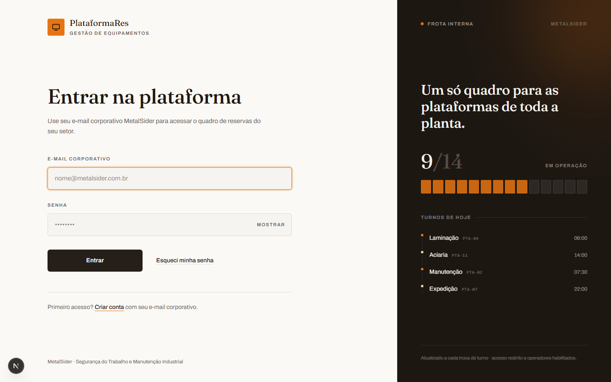
*Tela de entrada. À esquerda o formulário; à direita, o resumo da frota.*

1. Abra o endereço do sistema.
2. Digite seu **e-mail corporativo** (`@metalsider.com.br` — outros domínios não são aceitos).
3. Digite sua senha e clique em **Entrar**.

### Primeiro acesso

Se você ainda não tem conta, clique em **Criar conta** no rodapé da tela de login.

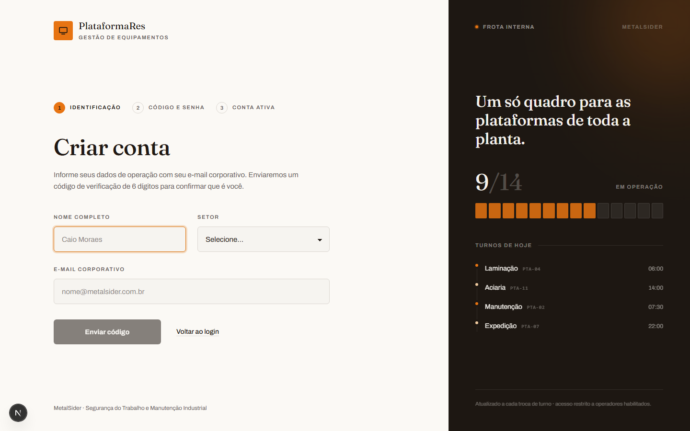
*O cadastro pede nome, e-mail corporativo e o seu setor.*

```text
Preencha nome, e-mail e setor
        ↓
Receba o código de 6 dígitos por e-mail
        ↓
Digite o código e crie sua senha
        ↓
Pronto — já pode entrar
```

> **Atenção:** o código vale **15 minutos**. Se expirar, é só pedir outro na mesma tela.

### Esqueceu a senha

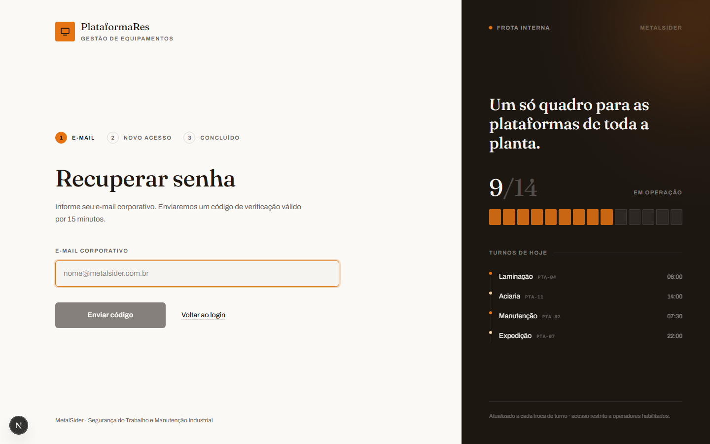
*Informe o e-mail e você recebe um código para definir uma senha nova.*

Sua senha precisa ter no mínimo 8 caracteres, com pelo menos uma letra maiúscula, uma
minúscula e um número.

---

## 2. Conhecendo a tela principal

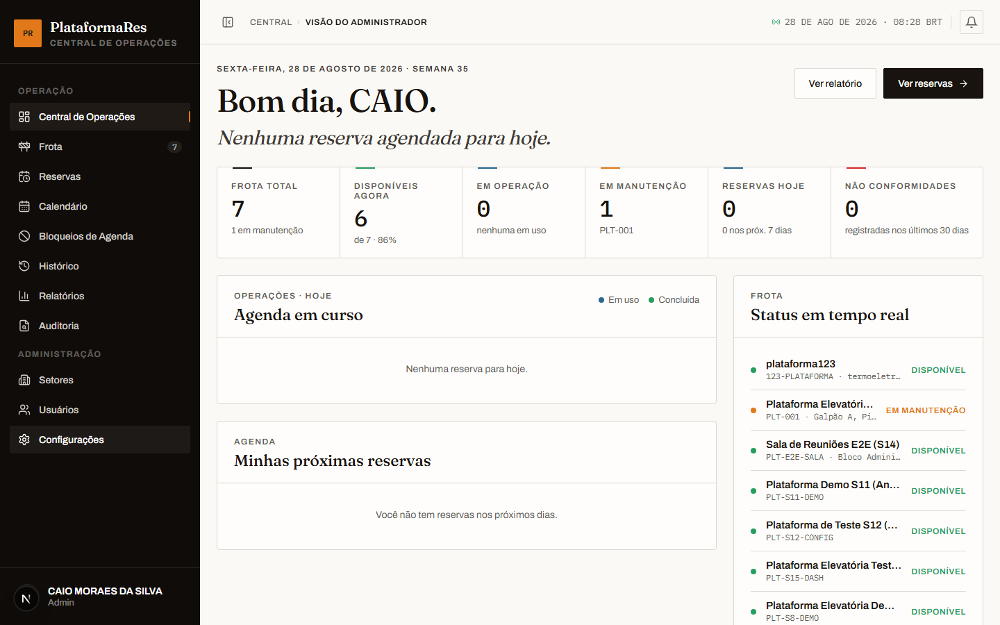
*Central de Operações. Esta é a visão de um Admin — um Colaborador vê o mesmo layout com menos itens no menu.*

O que está na tela:

1. **Menu lateral (esquerda)** — separado em *Operação* e *Administração*. Você só vê os itens
   que o seu perfil pode abrir.
2. **Barra superior** — caminho da página atual, data/hora e o **sino de notificações**.
3. **Faixa de números** — frota total, disponíveis agora, em operação, em manutenção, reservas
   de hoje e não conformidades dos últimos 30 dias.
4. **Agenda em curso** — o que está acontecendo hoje.
5. **Minhas próximas reservas** — os seus próximos agendamentos.
6. **Status em tempo real** — a frota inteira, atualizada sozinha (sem F5).
7. **Seu nome e perfil** — no rodapé do menu; é por ali que você sai do sistema.

> **Dica:** as telas se atualizam sozinhas. Quando alguém cria ou cancela uma reserva, ou uma
> plataforma muda de status, a sua tela acompanha sem precisar recarregar.

---

## 3. As áreas do sistema

| Área | Para que serve |
|---|---|
| **Central de Operações** | Panorama do dia: números da frota e suas próximas reservas |
| **Frota** | O catálogo de equipamentos, com status e ficha técnica |
| **Reservas** | Criar, acompanhar e cancelar reservas |
| **Calendário** | A mesma agenda, na visão semanal por horário |
| **Histórico** | Tudo que já aconteceu, com filtros e exportação para Excel |
| **Bloqueios de Agenda** | Fechar a agenda para manutenção ou parada *(Admin)* |
| **Relatórios** | Indicadores de uso, segurança e indisponibilidade *(Admin e Gestor)* |
| **Auditoria** | Quem fez o quê e quando *(Admin)* |
| **Setores / Usuários / Configurações** | Administração do sistema *(Admin)* |

### A Frota

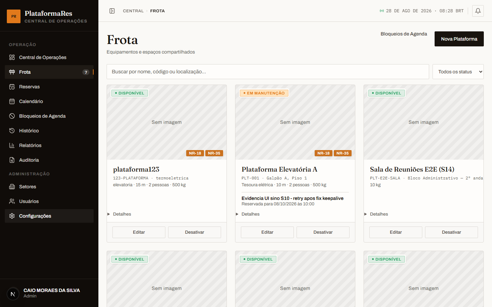
*Cada equipamento é um card com status, ficha técnica e o que está acontecendo com ele agora.*

Cada card mostra:

- **O selo de status** no topo: Disponível, Em manutenção, Reservada ou Inativa.
- **Os selos NR-18 / NR-35** no canto da imagem — indicam as normas de segurança aplicáveis
  ao equipamento (NR-35 aparece quando a altura máxima passa de 2 metros).
- **A ficha**: código, tipo, altura, quantidade de operadores e carga em kg.
- **O que está acontecendo**: "Reservada para 08/10 às 10:00" ou a última ocorrência, quando
  a plataforma está em manutenção.

> **Atenção:** plataformas **em manutenção** ou **inativas** não aparecem no formulário de nova
> reserva. Se o equipamento sumiu da lista, é por isso.

### O Calendário

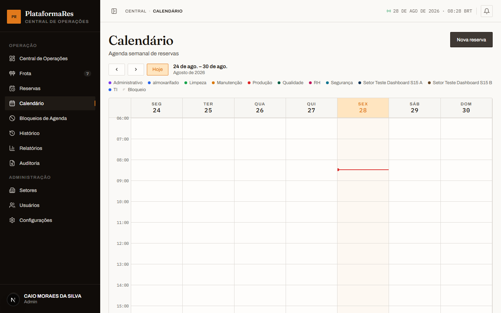
*A semana inteira, hora a hora. Cada setor tem sua cor, e os bloqueios aparecem hachurados.*

Use as setas para trocar de semana e o botão **Hoje** para voltar. A legenda no topo diz de
qual setor é cada cor.

---

## 4. Manual por perfil

# Perfil: Colaborador

É o perfil da maioria das pessoas. Você trabalha dentro do **seu setor**.

O que você pode fazer:

- Ver a frota inteira e o status de cada equipamento
- Criar reservas para o seu setor
- Ver, comentar e cancelar as reservas do seu setor
- Registrar não conformidades na timeline da reserva
- Consultar o calendário e o histórico do seu setor

O que você **não** vê: Relatórios, Auditoria, Bloqueios de Agenda e a área de Administração.
Esses itens nem aparecem no seu menu.

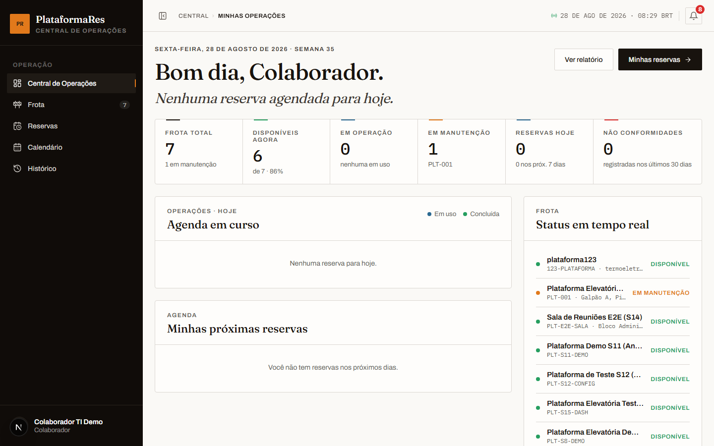
*Mesma Central de Operações, com o menu reduzido: Central, Frota, Reservas, Calendário e Histórico.*

## Criando uma reserva

Vá em **Reservas** e clique em **Nova reserva**.

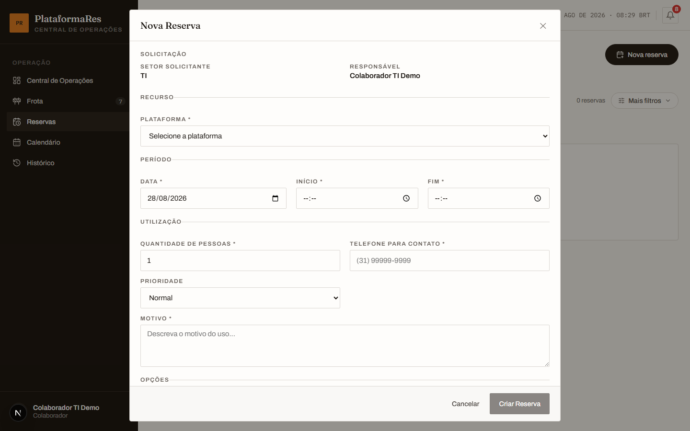
*O setor e o responsável já vêm preenchidos com os seus dados.*

```text
Escolha a plataforma
        ↓
Informe data, início e fim
        ↓
Diga quantas pessoas e o telefone de contato
        ↓
Escreva o motivo
        ↓
Criar Reserva
```

Preencha:

| Campo | O que informar |
|---|---|
| **Plataforma** | O equipamento. Só aparecem os que estão disponíveis |
| **Data / Início / Fim** | A janela de uso |
| **Quantidade de pessoas** | Quantas pessoas vão usar. O sistema confere contra a capacidade do equipamento |
| **Telefone para contato** | Quem chamar durante o uso desta reserva. **Obrigatório** |
| **Prioridade** | Normal, Alta ou Urgente |
| **Motivo** | Para que a reserva existe (mínimo 3 caracteres) |

Enquanto você escolhe o horário, o sistema já avisa se aquele espaço está ocupado — você não
precisa enviar para descobrir.

### Regras que o sistema aplica

> **Atenção:** estas regras são verificadas na hora de salvar. Se alguma barrar, a mensagem
> explica o motivo.

- **Antecedência mínima de 2 horas** entre agora e o início da reserva.
- **Duração máxima de 12 horas** por reserva.
- **Horário de expediente: 06:00 às 22:00.** Fora disso, só com prioridade **Urgente**.
- **Sem sobreposição:** ninguém pode reservar o mesmo equipamento no mesmo horário. Terminar
  às 10:00 e outra começar às 10:00 é permitido — encostar não é conflito.
- **Agenda bloqueada:** se houver bloqueio de manutenção no período, a reserva é recusada com
  o motivo do bloqueio.

*(Os valores de antecedência, duração e expediente são ajustáveis pelo Admin em Configurações.)*

### Repetir toda semana

Marque **repetir semanalmente** e escolha de 2 a 12 ocorrências. O sistema cria todas de uma
vez — e se **qualquer uma** delas cair num horário ocupado, nenhuma é criada. Ou vai tudo, ou
não vai nada.

## Acompanhando suas reservas

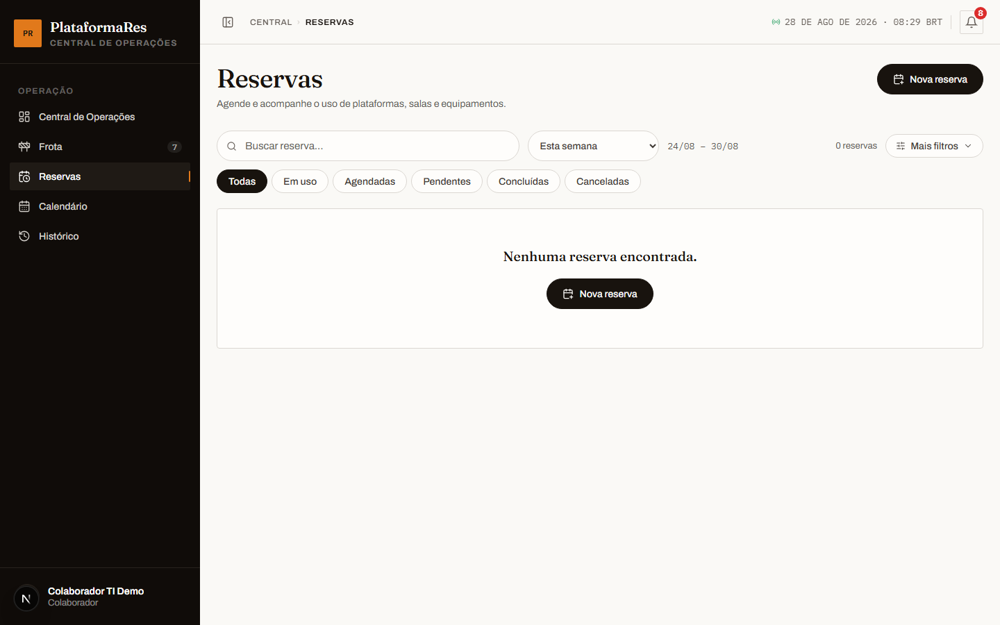
*A lista abre já na semana atual. Os botões filtram por situação.*

A reserva caminha sozinha:

```text
AGENDADA  ──▶  EM USO  ──▶  CONCLUÍDA
    │             │
    └─────────────┴──▶  CANCELADA
```

- **Agendada** — criada, esperando o horário.
- **Em uso** — o horário de início chegou; o sistema marcou automaticamente.
- **Concluída** — o horário de fim passou; o sistema encerrou.
- **Cancelada** — alguém cancelou antes do fim.

> **Dica:** você não precisa clicar em nada para iniciar ou encerrar. O sistema faz isso pelo
> relógio, mesmo com a aplicação fechada. A checagem roda a cada minuto.

## Comentários e não conformidades

Abra uma reserva e use a timeline no rodapé do detalhe.

- **Comentário** — uma observação qualquer. Pode ser só uma foto ("cheguei, está assim").
- **Não conformidade** — algo saiu errado. Aqui o texto é **obrigatório**: a foto mostra, mas
  não diz o que se esperava.

Você pode anexar até 4 imagens (JPEG, PNG ou WebP, até 10 MB cada). Quem já participou da
conversa e o solicitante recebem notificação e e-mail.

## Cancelando

No detalhe da reserva, clique em **Cancelar**. Você pode cancelar qualquer reserva **do seu
setor** que ainda esteja agendada ou em uso. Se for parte de uma série semanal, aparece
também **Cancelar série**, que derruba todas as ocorrências futuras de uma vez.

## Consultando o histórico

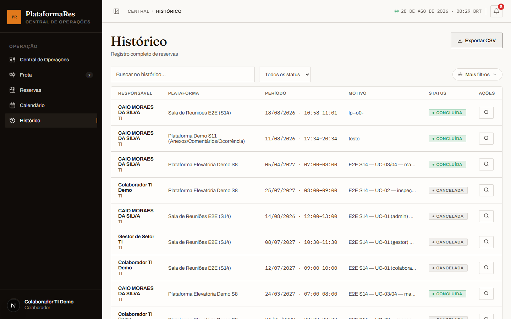
*O histórico do seu setor, com busca, filtros e exportação.*

Clique em **Exportar CSV** para abrir os dados no Excel.

---

# Perfil: Gestor de Setor

Tudo o que o Colaborador faz, mais duas coisas.

O que você pode fazer a mais:

- **Iniciar e concluir manualmente** as reservas do seu setor (exceções operacionais: o
  equipamento liberou antes, o uso terminou adiantado)
- **Ver os Relatórios** do seu setor

Continua valendo: você atua **apenas no seu setor**. Reservas de outros setores não aparecem
e não podem ser alteradas por você.

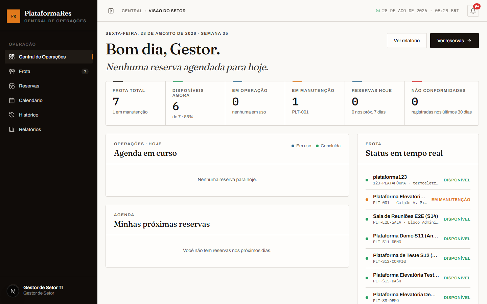
*O menu do Gestor tem Relatórios; não tem Auditoria, Bloqueios nem Administração.*

## Iniciar ou concluir uma reserva na mão

Abra a reserva na lista e use os botões do detalhe:

- **Iniciar uso** — disponível quando a reserva está *Agendada*.
- **Concluir** — disponível quando está *Em uso*.

> **Dica:** no dia a dia você não precisa desses botões — o sistema já faz a transição pelo
> horário. Eles existem para os casos fora do padrão.

## Relatórios do seu setor

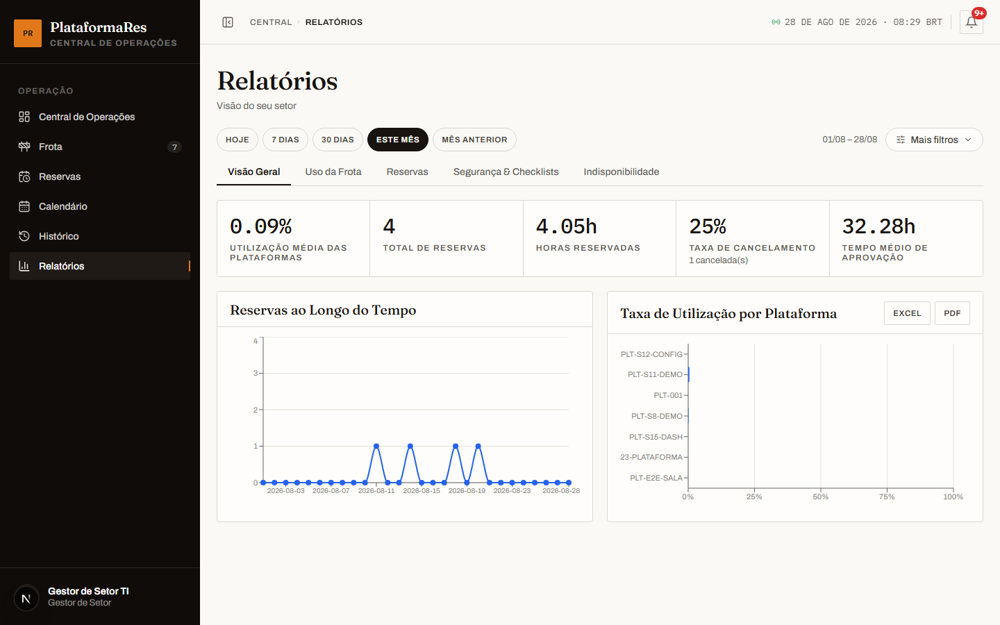
*Os números vêm filtrados pelo seu setor automaticamente.*

Escolha o período nos botões do topo (Hoje, 7 dias, 30 dias, Este mês, Mês anterior) e navegue
pelas abas: **Visão Geral**, **Uso da Frota**, **Reservas**, **Segurança & Checklists** e
**Indisponibilidade**.

Cada bloco de gráfico tem os botões **EXCEL** e **PDF** para exportar.

---

# Perfil: Admin

Enxerga e opera **todos os setores**, sem restrição de escopo.

O que só o Admin faz:

- Cadastrar e editar plataformas; mudar status para manutenção/inativa
- Criar e remover bloqueios de agenda
- Criar, editar, ativar/desativar usuários e trocar seus perfis
- Criar e editar setores
- Ajustar as configurações do sistema
- Consultar a Auditoria
- Ver os relatórios completos (incluindo Ranking de Setores e Segurança)

> **Atenção:** o Admin **não tem setor próprio**. Ao criar uma reserva, você precisa escolher
> para qual setor ela é.

## Cadastrando uma plataforma

Em **Frota**, clique em **Nova Plataforma**. Além do código e do nome, preencha a ficha técnica:

| Campo | Cuidado |
|---|---|
| **Capacidade (kg)** | Carga que o equipamento suporta |
| **Capacidade de operadores** | **Pessoas.** É este campo que valida a reserva — não o de kg |
| **Altura máxima (m)** | Acima de 2 m o card ganha o selo NR-35 |
| **Telefone de emergência** | Quem chamar se der problema com o equipamento |
| **Início/fim automático** | Se novas reservas deste equipamento começam e terminam sozinhas |

Para tirar um equipamento de circulação, use **Desativar** no card. Se houver reserva ativa,
o sistema recusa e pede que você cancele antes.

## Bloqueando a agenda

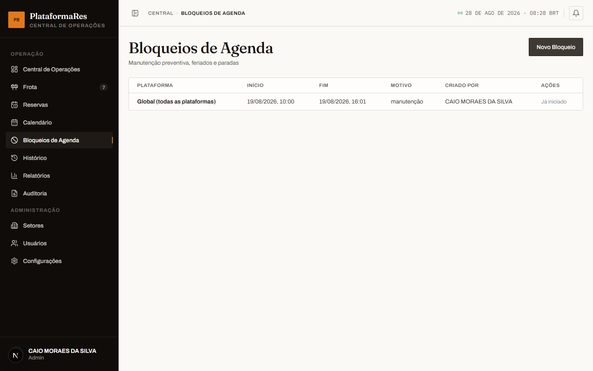
*Bloqueios fecham a agenda para manutenção preventiva, feriado ou parada de planta.*

```text
Escolha a plataforma (ou deixe em branco = TODAS)
        ↓
Informe início e fim do bloqueio
        ↓
Escreva o motivo
        ↓
Se houver reservas no período, confirme
```

> **Atenção:** deixar a plataforma em branco cria um **bloqueio global** — nenhuma reserva
> pode ser criada em nenhum equipamento naquele período.

Se já existirem reservas dentro da janela, o sistema mostra quais são e pede confirmação
explícita antes de gravar. Só bloqueios **futuros** podem ser removidos.

## Gerenciando usuários

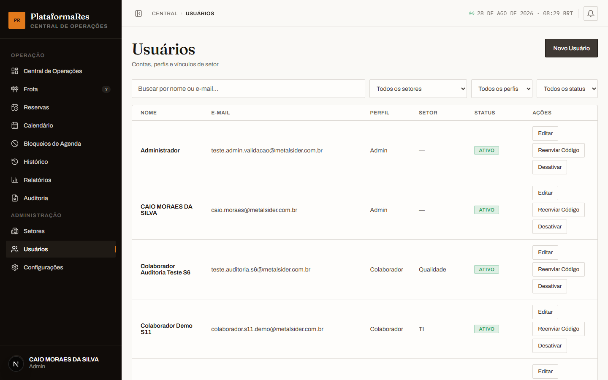
*Lista de contas com perfil, setor e status.*

- **Novo Usuário** — cria a conta e dispara o código de ativação por e-mail. Use quando
  precisar criar um Gestor ou outro Admin (o autocadastro sempre cria Colaborador).
- **Editar** — nome, e-mail, setor e perfil.
- **Reenviar Código** — reenvia a ativação, ou dispara uma redefinição de senha se a conta já
  estiver ativa.
- **Desativar** — soft delete: a conta perde o acesso, mas o histórico de reservas fica intacto.

> **Atenção:** você não consegue desativar a própria conta.

## Gerenciando setores

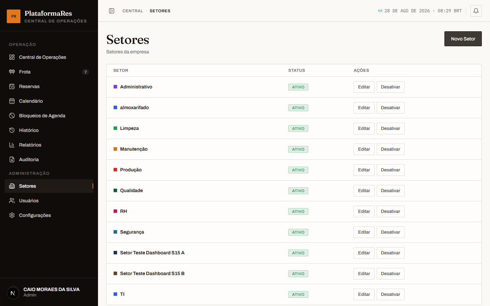
*Cada setor tem nome, cor e situação. A cor é a que aparece no Calendário.*

Um setor com usuário ativo vinculado não pode ser desativado — mova ou desative as pessoas antes.

## Configurações do sistema

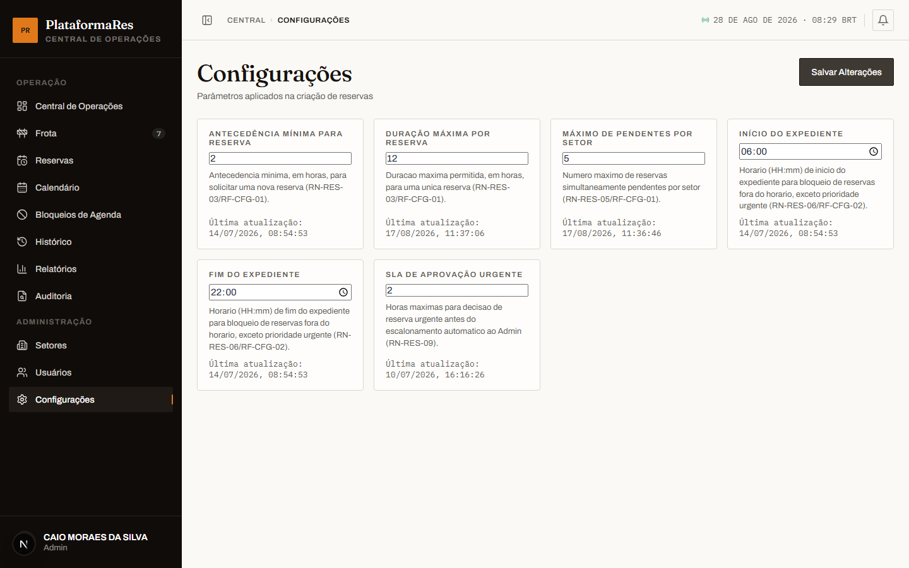
*Parâmetros aplicados na criação de reservas.*

| Configuração | Efeito |
|---|---|
| **Antecedência mínima** | Quanto tempo antes é preciso reservar |
| **Duração máxima** | Teto de horas de uma única reserva |
| **Início / fim do expediente** | Fora dessa faixa, só prioridade Urgente |
| **Máximo de pendentes por setor** | *Sem efeito no fluxo atual* |
| **SLA de aprovação urgente** | *Sem efeito no fluxo atual* |

Altere os valores e clique em **Salvar Alterações** — vale para a próxima reserva criada, sem
reiniciar nada.

> **Atenção:** os dois últimos parâmetros sobraram do antigo fluxo de aprovação, que não existe
> mais. Alterá-los não muda o comportamento do sistema.

## Auditoria

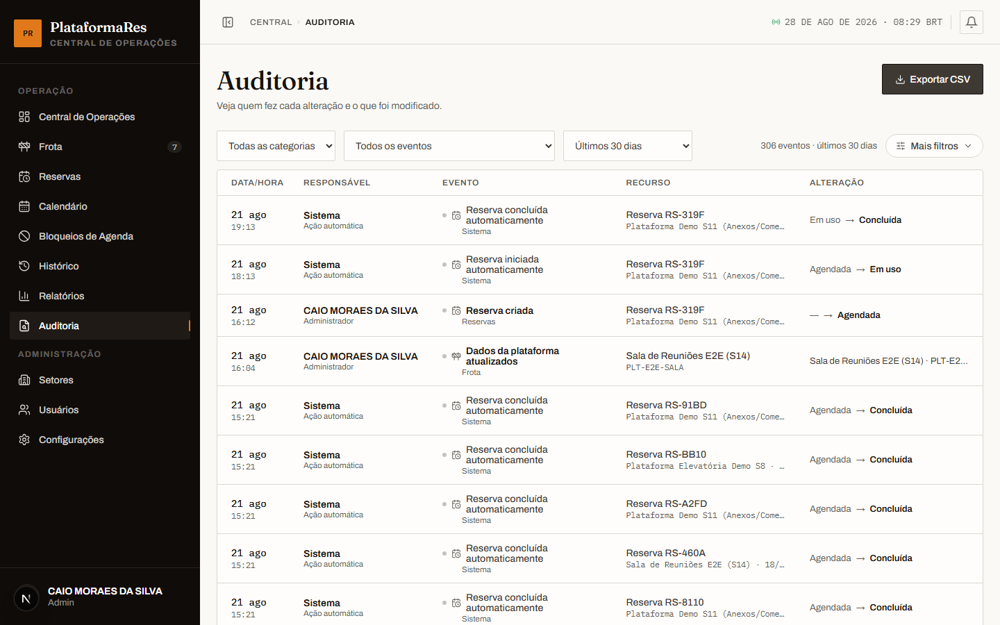
*Cada linha é uma operação: quando, quem, o quê, sobre qual recurso e o que mudou.*

Filtre por categoria, tipo de evento, período ou responsável. A coluna **Alteração** mostra a
transição de forma direta (`Agendada → Em uso`). Onde aparece **Sistema**, foi o próprio
servidor agindo pelo horário — não uma pessoa.

Clique em **Exportar CSV** para levar o recorte filtrado para fora.

## Relatórios completos

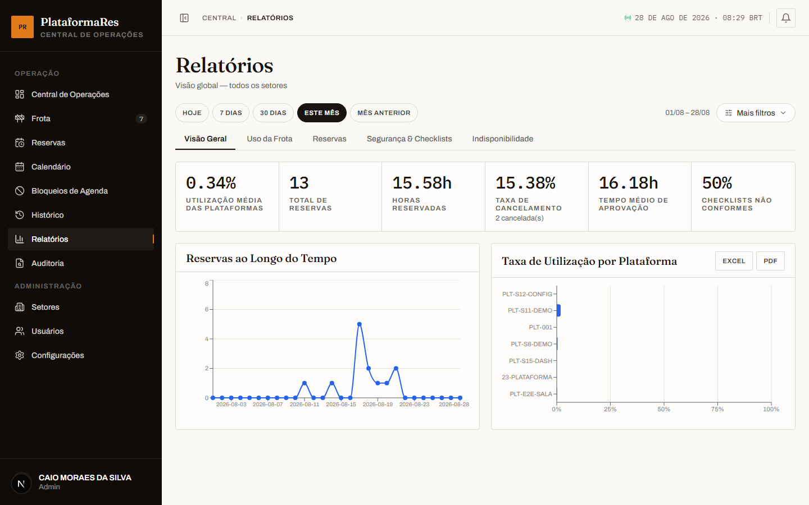
*Visão global de todos os setores, com cinco abas de indicadores.*

O Admin vê tudo, incluindo o **Ranking de Setores** e o relatório de **Segurança**, que não
aparecem para o Gestor. Use o filtro de período no topo e **Mais filtros** para restringir por
setor, plataforma ou categoria.

> **Atenção:** os indicadores **Tempo médio de aprovação** e **Checklists não conformes**
> referem-se a etapas que não existem mais no fluxo. Eles só refletem dados históricos e não
> devem ser lidos como métrica da operação atual.

---

## 5. Minha conta

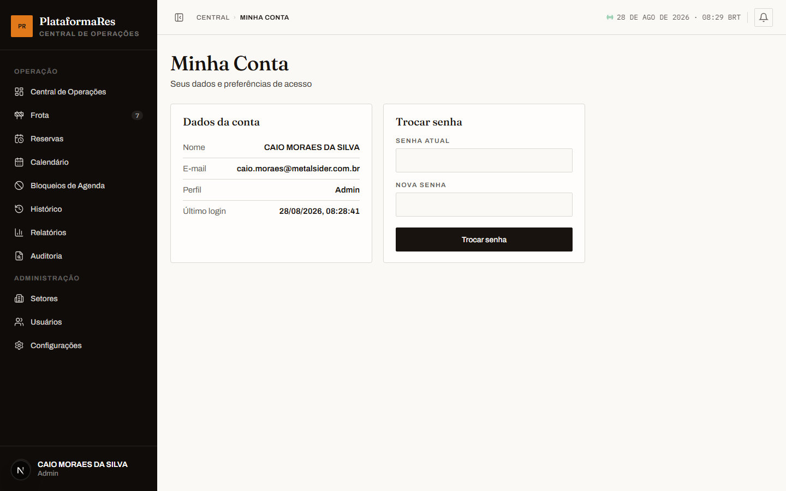
*Seus dados e a troca de senha.*

Clique no seu nome, no rodapé do menu, para chegar aqui ou para **Sair**. Na troca de senha,
informe a senha atual e a nova (mínimo 8 caracteres, com maiúscula, minúscula e número).

---

## 6. Notificações

O **sino** na barra superior mostra quantas mensagens não lidas você tem. Elas chegam em tempo
real, sem recarregar a página.

Você é notificado quando:

- alguém comenta numa reserva de que você participa;
- alguém registra uma não conformidade nessa reserva;
- *(Admin)* uma ocorrência de gravidade alta é reportada.

Clique numa notificação para ir direto à reserva, ou use **marcar todas como lidas**.

---

## 7. Perguntas rápidas

**Criei a reserva e nada acontece no horário.**
O sistema verifica a cada minuto — pode levar até 60 segundos para a reserva virar *Em uso*.

**A plataforma sumiu da lista de nova reserva.**
Ela está em manutenção ou inativa. Confira o status dela na tela Frota.

**Não consigo ver uma reserva que um colega criou.**
Você só enxerga reservas do seu setor. Reservas de outros setores são invisíveis para
Colaborador e Gestor — isso é regra, não erro.

**Preciso reservar às 5 da manhã.**
Fora do expediente (06:00–22:00) só com prioridade **Urgente**.

**Cancelei sem querer.**
Não há como reverter: cancelada é um estado final. Crie uma nova reserva.

**O código de ativação não chegou.**
Confira o spam. Se não vier, peça o reenvio na própria tela — ou peça ao Admin para usar
**Reenviar Código** na tela de Usuários.
