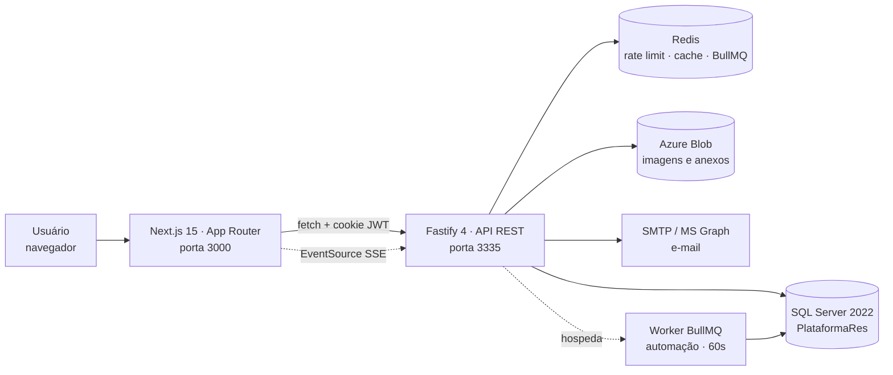
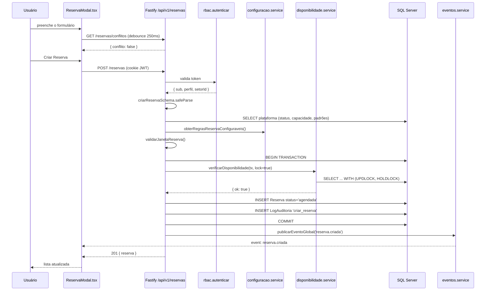

# Arquitetura do Sistema — Guia para Desenvolvedores

> Levantado por leitura do código e execução da aplicação em 28/08/2026 (branch `main`,
> incluindo alterações não commitadas da migration 0018). Para o modelo de dados, ver
> [01-banco-de-dados.md](./01-banco-de-dados.md).

---

## 1. Visão geral

Monorepo pnpm com três pacotes: um frontend Next.js, uma API Fastify e um pacote `shared` de
schemas Zod que os dois importam — é ele que impede o contrato de divergir.



**O que caracteriza a arquitetura:**

- **Sem ORM.** SQL parametrizado escrito à mão, direto no pool `mssql`.
- **Sem camada de repositório.** Rotas falam com o banco; os *services* guardam regra de
  negócio pura e testável.
- **Contrato compartilhado.** Todo payload é validado por um schema Zod que vive em
  `packages/shared` e é importado pelos dois lados.
- **Estado temporal no servidor.** A reserva muda de status por um worker BullMQ, nunca por
  timer no navegador.
- **Tempo real por SSE**, com uma única conexão por aba.

---

## 2. Tecnologias

| Camada | Tecnologia | Versão | Responsabilidade |
|---|---|---|---|
| Frontend | Next.js (App Router) | 15.5.20 | Páginas, RSC, redirect por perfil |
| | React | 19.0.0 | UI |
| | CSS Modules | — | Estilo, sem framework CSS |
| | Recharts | 2.15 | Gráficos dos relatórios |
| | lucide-react | 1.24 | Ícones |
| Backend | Node.js | ≥ 20 (rodando 24) | Runtime |
| | Fastify | 4.28 | HTTP, CORS, Helmet, cookies |
| | Zod | 3.23 | Validação de entrada |
| | jsonwebtoken | 9.0 | Sessão JWT |
| | bcrypt | 5.1 | Hash de senha (12 rounds) |
| | BullMQ + ioredis | 5.12 / 5.4 | Fila de e-mail e worker de automação |
| | exceljs / puppeteer | 4.4 / 25.3 | Exportação Excel e PDF |
| Banco | SQL Server | 2022 | Persistência |
| | driver `mssql` | 11.0 | Acesso |
| Infra | Redis | 7 | Rate limit, cache de relatórios, filas |
| | Azure Blob Storage | SDK 12.33 | Imagens e anexos (Azurite em dev) |
| | Microsoft Graph / SMTP | 3.0 / nodemailer 9 | Envio de e-mail |
| Testes | Vitest | 3.2 | Unitários e integração |
| | Playwright | 1.48 | E2E |
| Build | pnpm workspaces | 11 | Monorepo |
| | TypeScript | 5.5 | `strict: true` em todos os pacotes |

---

## 3. Árvore do projeto

```text
reserva_plataforma/
├── apps/
│   ├── api/                      # Backend Fastify
│   │   └── src/
│   │       ├── server.ts         # Entrypoint: boot, workers, shutdown gracioso
│   │       ├── app.ts            # buildApp(): plugins, error handler, registro de rotas
│   │       ├── db/
│   │       │   ├── pool.ts       # Pool mssql (max 25 conexões)
│   │       │   ├── redis.ts      # Cliente ioredis
│   │       │   ├── migrate.ts    # Runner de migrations (up/down/status/baseline)
│   │       │   ├── seed.ts       # Setores + primeiro Admin
│   │       │   └── migrations/   # 0001..0018 .sql, com marcadores ==UP== / ==DOWN==
│   │       ├── middlewares/
│   │       │   └── rbac.ts       # autenticar, requireRole, escopo por setor
│   │       ├── routes/           # 18 arquivos = 18 domínios HTTP
│   │       ├── services/         # Regra de negócio (a maioria pura e testável)
│   │       ├── utils/            # jwt, password, cors
│   │       └── tests/            # unit/ e integration/
│   ├── web/                      # Frontend Next.js
│   │   ├── app/
│   │   │   ├── (auth)/           # login, ativar-conta, recuperar-senha
│   │   │   └── (app)/            # área autenticada (layout faz o guard)
│   │   ├── components/           # *Client.tsx = client components com a lógica de tela
│   │   └── lib/                  # api.ts (fetch), hooks (SSE, modal, debounce)
│   └── e2e/                      # Playwright: 7 specs (casos de uso + responsividade)
├── packages/
│   └── shared/src/
│       ├── enums.ts              # PERFIS, STATUS_RESERVA, CATEGORIAS_PLATAFORMA...
│       ├── datetime.ts           # Conversão Brasília ↔ UTC
│       ├── telefone.ts           # Validação de telefone BR
│       ├── schemas/              # Um Zod por domínio — o contrato da API
│       └── auditoria/            # Catálogo de eventos: código → título/categoria
├── docs/                         # Esta documentação
└── scripts/check-port-free.mjs   # Impede duas instâncias na mesma porta
```

**Por que cada pasta existe:**

- **`routes/`** — um arquivo por domínio. Faz validação Zod, RBAC, transação e o SQL.
- **`services/`** — onde vive a regra. Boa parte é **função pura** (sem banco), o que é o que
  torna a suíte unitária possível: `conflito.service.ts`, `reservaEstado.service.ts`,
  `relatorio.service.ts` e `recorrencia.service.ts` não tocam no pool.
- **`packages/shared/`** — o antídoto contra frontend e backend divergirem. `main` aponta para
  `src/index.ts` (sem build próprio), por isso o Next precisa de `transpilePackages`.
- **`components/*Client.tsx`** — a página em `app/` é um Server Component que só busca
  `/api/v1/conta`, decide o redirect e delega para o client component.

---

## 4. Arquivos que importam

| Arquivo | Responsabilidade |
|---|---|
| [`apps/api/src/server.ts`](../apps/api/src/server.ts) | Valida config de e-mail, sobe workers, abre a porta, encerramento gracioso |
| [`apps/api/src/app.ts`](../apps/api/src/app.ts) | Monta o Fastify: CORS, Helmet, envelope de erro `{ erro }`, registro das 18 rotas |
| [`apps/api/src/middlewares/rbac.ts`](../apps/api/src/middlewares/rbac.ts) | `autenticar`, `requireRole([...])` e `usuarioNoEscopoDaReserva` — **os 3 mecanismos de autorização** |
| [`apps/api/src/utils/jwt.ts`](../apps/api/src/utils/jwt.ts) | Assina/verifica o JWT; recusa subir em produção sem `JWT_SECRET` |
| [`apps/api/src/db/pool.ts`](../apps/api/src/db/pool.ts) | Pool mssql; limpa a promise em falha para não travar a API após queda do banco |
| [`apps/api/src/db/migrate.ts`](../apps/api/src/db/migrate.ts) | Runner com checksum, split de `GO`, transação por migration |
| [`apps/api/src/routes/reservas.ts`](../apps/api/src/routes/reservas.ts) | Criação de reserva: onde vivem quase todas as regras do domínio |
| [`apps/api/src/services/disponibilidade.service.ts`](../apps/api/src/services/disponibilidade.service.ts) | **Fonte única** de "está livre?" — conflito + bloqueio, com e sem lock |
| [`apps/api/src/services/reservaEstado.service.ts`](../apps/api/src/services/reservaEstado.service.ts) | Máquina de estados da reserva (função pura) |
| [`apps/api/src/services/reservaTransicao.service.ts`](../apps/api/src/services/reservaTransicao.service.ts) | Executa a transição — mesma função para clique manual e worker |
| [`apps/api/src/services/automacaoReserva.service.ts`](../apps/api/src/services/automacaoReserva.service.ts) | Varredura por horário: inicia, conclui e recupera janelas perdidas |
| [`apps/api/src/services/queue.ts`](../apps/api/src/services/queue.ts) | Filas BullMQ: `email` e `automacao-reserva` |
| [`apps/api/src/services/conflito.service.ts`](../apps/api/src/services/conflito.service.ts) | Sobreposição de horário e validação de janela (puro) |
| [`apps/api/src/services/configuracao.service.ts`](../apps/api/src/services/configuracao.service.ts) | Lê `ConfiguracaoSistema` com cache em memória, invalidado na escrita |
| [`apps/api/src/services/plataforma.service.ts`](../apps/api/src/services/plataforma.service.ts) | Fragmentos SQL do status derivado, utilização 30d e evento em destaque |
| [`apps/api/src/services/storage.service.ts`](../apps/api/src/services/storage.service.ts) | Azure Blob + SAS de leitura + **detecção de mime por magic bytes** |
| [`apps/api/src/services/email.service.ts`](../apps/api/src/services/email.service.ts) | Resolve provedor (SMTP/Graph/disco), templates, diagnóstico no boot |
| [`apps/api/src/services/otp.service.ts`](../apps/api/src/services/otp.service.ts) | Ponto único de emissão de código, com lock de 30 s no Redis |
| [`apps/api/src/services/eventos.service.ts`](../apps/api/src/services/eventos.service.ts) | Registro de clientes SSE e fan-out de eventos |
| [`packages/shared/src/enums.ts`](../packages/shared/src/enums.ts) | Perfis, status, categorias — e a marcação do que é legado |
| [`packages/shared/src/datetime.ts`](../packages/shared/src/datetime.ts) | `combinarDataHoraBrasilia` — a conversão de fuso do sistema |
| [`apps/web/app/(app)/layout.tsx`](<../apps/web/app/(app)/layout.tsx>) | Guard da área autenticada: sem cookie → `/login` |
| [`apps/web/components/Sidebar.tsx`](../apps/web/components/Sidebar.tsx) | `NAV_ITEMS` — **a definição do menu e de quais perfis veem cada item** |
| [`apps/web/lib/api.ts`](../apps/web/lib/api.ts) | `apiFetch`/`apiDownload` + `ApiRequestError` com status tipado |
| [`apps/web/lib/useEventosSSE.ts`](../apps/web/lib/useEventosSSE.ts) | Uma conexão SSE por processo, com backoff exponencial |

---

## 5. Fluxo de uma requisição

Criação de reserva, ponta a ponta:



O detalhe que importa: **a checagem de conflito acontece dentro da transação**, com lock de
intervalo sobre `(plataforma_id, data)`. Duas requisições simultâneas para o mesmo horário
serializam — a segunda lê o estado já gravado pela primeira e recebe 409.

---

## 6. Domínios

### Reservas

```text
Frontend   ReservasClient.tsx · CalendarioClient.tsx · ReservaModal.tsx · ReservaDetalheModal.tsx
Endpoint   POST /reservas · GET /reservas · GET /reservas/conflitos
           PATCH /reservas/:id/status · POST /reservas/:id/cancelar
           POST /reservas/recorrencia/:id/cancelar
Backend    routes/reservas.ts
           → services/disponibilidade.service.ts  (conflito + bloqueio)
           → services/conflito.service.ts         (janela, sobreposição — puro)
           → services/configuracao.service.ts     (regras configuráveis)
           → services/reservaEstado.service.ts    (transições válidas — puro)
           → services/reservaTransicao.service.ts (UPDATE condicional + auditoria + SSE)
           → services/recorrencia.service.ts      (datas da série — puro)
Banco      Reserva, ReservaRecorrencia, BloqueioAgenda, LogAuditoria
Fluxo      agendada → em_uso → concluida, com cancelada como terminal alternativo.
           Quem move é o worker por horário; o clique manual é fallback administrativo.
```

**Idempotência.** `aplicarTransicao` faz `UPDATE ... WHERE id = @id AND status = @status_de`
com `OUTPUT INSERTED.id`. Quem executa primeiro casa o WHERE; quem chega depois recebe 0
linhas e para. Não há leitura-seguida-de-escrita, logo não há janela de corrida entre o
clique do usuário e o job.

### Frota (Plataformas)

```text
Frontend   PlataformasClient.tsx · PlataformaModal.tsx
Endpoint   GET /plataformas (todos) · POST/PUT/PATCH :id/status (Admin)
Backend    routes/plataformas.ts → services/plataforma.service.ts, storage.service.ts
Banco      Plataforma, Ocorrencia (evento em destaque), Reserva (status derivado)
Fluxo      O status 'reservada' e a utilização 30d são CALCULADOS na leitura, via CTE —
           nunca persistidos. A imagem é chave de blob; o SAS é gerado por requisição.
```

### Timeline da reserva (comentários, anexos, ocorrências)

```text
Frontend   ComentariosReserva.tsx (dentro de ReservaDetalheModal)
Endpoint   GET/POST /reservas/:id/comentarios
           GET/POST /reservas/:id/anexos          (modelo anterior, ainda ativo)
           POST /reservas/:id/ocorrencia          (modelo anterior, ainda ativo)
Backend    routes/comentarios.ts — UNION de Comentario + Anexo + Ocorrencia numa só linha
           do tempo; as duas últimas entram marcadas como histórico somente-leitura
Banco      Comentario, ComentarioImagem, Anexo, Ocorrencia
Fluxo      Upload dos blobs ANTES da transação (não segurar lock durante I/O de rede);
           mime verificado pelos bytes reais; rollback limpa os blobs órfãos.
```

### Bloqueios de agenda

```text
Frontend   BloqueiosClient.tsx
Endpoint   GET /bloqueios (todos) · POST /bloqueios · DELETE /bloqueios/:id (Admin)
Backend    routes/bloqueios.ts → services/conflito.service.ts (reservasDentroDoIntervalo)
Banco      BloqueioAgenda
Fluxo      POST com reservas colidindo responde 200 { requerConfirmacao, reservasConflitantes }
           em vez de gravar. O Admin reenvia com confirmar=true.
```

### Relatórios

```text
Frontend   RelatoriosClient.tsx (5 abas) · DashboardClient.tsx (reusa 2 endpoints)
Endpoint   /relatorios/{utilizacao,operacional,sla-aprovacao,checklists,bloqueios}  Admin+Gestor
           /relatorios/{ranking-setores,seguranca}                                  Admin
           /relatorios/export?relatorio=&formato=pdf|excel                           Admin+Gestor
Backend    routes/relatorios.ts     — SQL de agregação
           services/relatorio.service.ts       — TODO o cálculo, em funções puras
           services/relatorioCache.service.ts  — cache Redis, TTL 15 min
           services/relatorioExport.service.ts — exceljs e puppeteer
Banco      Reserva, Plataforma, Setor, BloqueioAgenda, Ocorrencia, Checklist*, LogAuditoria
```

O escopo é resolvido por `resolverEscopoSetor()`: Admin filtra livre, Gestor é **sempre**
restrito ao próprio setor mesmo enviando `?setor=<outro>`.

### Auditoria

```text
Frontend   AuditoriaClient.tsx · AuditoriaDetalheDrawer.tsx · lib/auditoria.ts
Endpoint   GET /auditoria · GET /auditoria/export  (Admin)
Backend    routes/auditoria.ts + packages/shared/src/auditoria/ (catálogo de eventos)
Banco      LogAuditoria + LEFT JOINs condicionados para resolver o nome do recurso
Fluxo      Toda rota de escrita grava o LogAuditoria NA MESMA TRANSAÇÃO da operação.
           Categoria e importância são grupos de apresentação expandidos para IN (...)
           no servidor, porque a listagem é paginada no banco.
```

### Notificações e tempo real

```text
Frontend   NotificationBell.tsx + lib/useEventosSSE.ts (uma conexão por processo)
Endpoint   GET /eventos (SSE) · GET/PATCH /notificacoes
Backend    routes/eventos.ts + services/eventos.service.ts + notificacao.service.ts
Banco      Notificacao
Eventos    reserva.criada · reserva.status_alterado · plataforma.status_alterado
           notificacao.nova (dirigido ao destinatário)
Fluxo      A Notificacao é gravada na transação da operação; o evento SSE é publicado
           DEPOIS do commit, best-effort — SSE ausente nunca reverte a operação.
```

### Checklist de segurança — legado

```text
Endpoint   /checklist-modelos, /checklist-itens, /checklists,
           /reservas/:id/checklist (GET/PUT), /reservas/:id/checklist/finalizar
Backend    routes/checklist.ts (1.055 linhas) + services/checklist.service.ts
Banco      ChecklistTemplate, ChecklistItemTemplate, ChecklistPreenchido, ChecklistResposta
Estado     ⚠️ A API está viva e funcional, mas NENHUMA tela do frontend a consome.
           As páginas e componentes de checklist foram removidos junto com a migration 0018.
```

### Autenticação e conta

```text
Frontend   app/(auth)/login · ativar-conta · recuperar-senha · TrocarSenhaForm.tsx
Endpoint   POST /auth/{login,logout,cadastrar,ativar-conta,ativar-conta/reenviar,
                        recuperar-senha,recuperar-senha/confirmar}
           GET /conta · PATCH /conta/senha
Backend    routes/auth.ts · routes/conta.ts
           → services/otp.service.ts   (emissão do código, lock Redis 30s)
           → services/rateLimit.ts     (5 logins/10min · 8 códigos/15min · 20 pedidos/IP)
           → utils/password.ts, utils/jwt.ts
Banco      Usuario, CodigoVerificacao, LogAuditoria
Fluxo      Autocadastro cria SEMPRE perfil 'colaborador'. As rotas públicas de solicitação
           respondem de forma genérica para não revelar se o e-mail tem conta.
```

### Usuários e setores (Administração)

```text
Frontend   UsuariosClient.tsx · UsuarioModal.tsx · SetoresClient.tsx · SetorModal.tsx
Endpoint   GET/POST /usuarios · PATCH /usuarios/:id · PATCH /usuarios/:id/status
           PATCH /usuarios/:id/perfil · POST /usuarios/:id/reenviar-codigo      (Admin)
           GET /setores/publicos (público) · GET /setores (autenticado)
           GET /setores/admin · POST /setores · PATCH /setores/:id · :id/status (Admin)
Backend    routes/usuarios.ts · routes/setores.ts
Banco      Usuario, Setor, CodigoVerificacao, LogAuditoria
Fluxo      Desativação é soft delete. RN-USR-01: perfil admin ⇒ setor_id NULL.
           RN-USR-02: setor com usuário ativo não pode ser desativado.
```

### Dashboard e Histórico

```text
Frontend   DashboardClient.tsx · HistoricoClient.tsx · FiltrosAvancados.tsx
Endpoint   GET /dashboard/kpis · GET /dashboard/agenda
           GET /historico · GET /historico/export (CSV com BOM UTF-8)
Backend    routes/dashboard.ts · routes/historico.ts — ambos reusam SELECT_RESERVA/
           FROM_RESERVA/mapReserva exportados de routes/reservas.ts
Banco      Reserva, Plataforma, Setor, Comentario
Fluxo      Escopo por setor aplicado no WHERE (aplicarEscopoSetor / montarWhereHistorico):
           Colaborador e Gestor nunca recebem linha de outro setor, mesmo enviando ?setor=.
           A paginação vai em headers (X-Total-Count / X-Limit / X-Offset).
```

---

## 7. Autenticação e autorização

```text
POST /auth/login
        ↓
bcrypt.compare  →  rate limit no Redis (5 tentativas / 10 min por e-mail)
        ↓
assinarToken({ sub, email, perfil, setorId })    ← HS256, expira em 8h
        ↓
Set-Cookie: token=<jwt>  httpOnly · sameSite=strict · secure em produção
        ↓
Toda requisição seguinte:  preHandler autenticar → request.usuario
        ↓
requireRole(['admin'])                 ← camada 1: perfil
        ↓
usuarioNoEscopoDaReserva(usuario, ...) ← camada 2: setor do recurso
```

**Onde tudo acontece**

| Etapa | Arquivo |
|---|---|
| Login, cadastro, ativação, recuperação | `routes/auth.ts` |
| Emissão do código OTP | `services/otp.service.ts` |
| Geração/validação do JWT | `utils/jwt.ts` |
| Hash e comparação de senha | `utils/password.ts` |
| Guard das rotas | `middlewares/rbac.ts` |
| Guard das páginas | `app/(app)/layout.tsx` + cada `page.tsx` |
| Origens permitidas (CORS) | `utils/cors.ts` |

**Detalhes que valem saber**

- O token vai **em cookie httpOnly**. O JavaScript da página não o lê; o `fetch` usa
  `credentials: "include"`.
- **Sem refresh token.** Expirou em 8h, é login de novo.
- **Sem logout server-side.** `POST /auth/logout` só limpa o cookie; um token capturado
  continua válido até expirar.
- O **escopo por setor é uma segunda camada**, aplicada dentro do handler depois de carregar o
  recurso — `requireRole` sozinho não sabe de qual setor é a reserva.
- Códigos OTP: 6 dígitos com `crypto.randomInt`, válidos 15 min, comparados em tempo
  constante, com rate limit próprio (8 tentativas / 15 min) e lock de emissão de 30 s.
- As rotas públicas de solicitação de código respondem **sempre de forma genérica**, para não
  revelar se um e-mail tem conta.

### Perfis e permissões

Três perfis, definidos em `CK_Usuario_perfil` (banco) e `PERFIS` (`shared/enums.ts`).

| Funcionalidade | Colaborador | Gestor de Setor | Admin |
|---|:---:|:---:|:---:|
| Ver frota | ✓ | ✓ | ✓ |
| Criar reserva | ✓ (seu setor) | ✓ (seu setor) | ✓ (escolhe o setor) |
| Ver reservas | ✓ (seu setor) | ✓ (seu setor) | ✓ (todos) |
| Cancelar reserva | ✓ (seu setor) | ✓ (seu setor) | ✓ (todas) |
| Iniciar / concluir uso manualmente | ✗ | ✓ (seu setor) | ✓ (todas) |
| Comentar / registrar não conformidade | ✓ (seu setor) | ✓ (seu setor) | ✓ (todas) |
| Calendário e Histórico | ✓ (seu setor) | ✓ (seu setor) | ✓ (todos) |
| Relatórios — utilização, operacional, SLA, checklists, bloqueios | ✗ | ✓ (seu setor) | ✓ (global) |
| Relatórios — ranking de setores, segurança | ✗ | ✗ | ✓ |
| Bloqueios de agenda (criar/remover) | ✗ | ✗ | ✓ |
| CRUD de plataformas | ✗ | ✗ | ✓ |
| CRUD de usuários e setores | ✗ | ✗ | ✓ |
| Configurações do sistema | ✗ | ✗ | ✓ |
| Auditoria | ✗ | ✗ | ✓ |
| Modelos de checklist — leitura | ✓ | ✓ | ✓ |
| Modelos de checklist — escrita | ✗ | ✗ | ✓ |

> Esta matriz foi **verificada em execução**: cada rota Admin-only foi chamada com token de
> Gestor e de Colaborador e devolveu 403; cada recurso de outro setor devolveu 403 para ambos.

---

## 8. Configuração

Backend: `apps/api/.env`. Frontend: `apps/web/.env.local`. Modelo em `.env.example`.

| Variável | Uso |
|---|---|
| `DB_HOST` / `DB_PORT` / `DB_NAME` / `DB_USER` / `DB_PASSWORD` | Conexão com o SQL Server |
| `DB_ENCRYPT` / `DB_TRUST_SERVER_CERTIFICATE` | TLS da conexão |
| `DB_POOL_MAX` / `DB_POOL_MIN` | Tamanho do pool (padrão 25 / 2) |
| `REDIS_URL` | Rate limit, cache de relatórios, filas BullMQ |
| `JWT_SECRET` | Assinatura do token. **Obrigatória em produção** — a API não sobe sem |
| `JWT_EXPIRES_IN` | Validade da sessão (padrão `8h`) |
| `API_PORT` | Porta da API (padrão 3335) |
| `WEB_ALLOWED_ORIGINS` | Origens aceitas no CORS (lista separada por vírgula) |
| `NODE_ENV` | `production` liga HSTS, cookie `secure` e oculta erro interno |
| `EMAIL_PROVIDER` | `smtp` ou `graph`. Declarado ⇒ boot falha se a config estiver incompleta |
| `EMAIL_HOST` / `EMAIL_PORT` / `EMAIL_SECURE` / `EMAIL_USER` / `EMAIL_PASSWORD` / `EMAIL_FROM` / `EMAIL_FROM_NAME` | Provedor SMTP |
| `GRAPH_TENANT_ID` / `GRAPH_CLIENT_ID` / `GRAPH_CLIENT_SECRET` / `GRAPH_SENDER` | Provedor Microsoft Graph |
| `AZURE_STORAGE_CONNECTION_STRING` / `AZURE_STORAGE_CONTAINER` | Blob Storage (Azurite em dev) |
| `SEED_ADMIN_EMAIL` / `SEED_ADMIN_PASSWORD` | Usadas por `pnpm seed` **e pela suíte de integração** |
| `NEXT_PUBLIC_API_URL` | URL da API vista pelo navegador |

> Sem nenhuma credencial de e-mail, em desenvolvimento o e-mail é **gravado em disco** em
> `apps/api/emails-dev/*.html` e o fluxo continua testável. Em produção, o envio falha
> explicitamente com 502 — nunca finge sucesso.

---

## 9. Como rodar o projeto

```text
Pré-requisitos       Node ≥ 20 · pnpm 11 · SQL Server 2022 · Redis 7 · (Azurite, opcional)
        ↓
Configuração         cp .env.example apps/api/.env  e preencher
                     echo "NEXT_PUBLIC_API_URL=http://localhost:3335" > apps/web/.env.local
        ↓
Dependências         pnpm install
        ↓
Banco                pnpm migrate:up   →   pnpm seed
        ↓
Backend              pnpm dev:api      (porta 3335)
        ↓
Frontend             pnpm dev:web      (porta 3000)
```

Comandos reais, todos do `package.json`:

```bash
pnpm install
```

```bash
pnpm migrate:up
```

```bash
pnpm seed
```

```bash
pnpm dev:api
```

```bash
pnpm dev:web
```

Outros scripts úteis:

| Comando | O que faz |
|---|---|
| `pnpm lint` | `tsc --noEmit` nos três pacotes |
| `pnpm build` | `tsc` na API + `next build` no web |
| `pnpm test` | Vitest na API (unit + integração) |
| `pnpm test:e2e` | Playwright — **exige API e web já rodando** |
| `pnpm test:e2e:seed` | Prepara as contas de teste E2E (escreve no banco) |
| `pnpm --filter @plataformares/api migrate:status` | Lista o que já foi aplicado |
| `pnpm --filter @plataformares/api migrate:baseline` | Adota um banco com schema aplicado à mão |
| `pnpm --filter @plataformares/api email:diagnose <email>` | Testa o provedor de e-mail |

> **Atenção:** `pnpm dev:api` e `pnpm dev:web` chamam `scripts/check-port-free.mjs` antes de
> subir. Se a porta estiver ocupada, o comando **aborta de propósito** — duas instâncias na
> mesma pasta corrompem o cache `.next`/`dist` compartilhado.

---

## 10. Build e deploy

**Build — confirmado, executado nesta auditoria:**

| Pacote | Comando | Artefato |
|---|---|---|
| `@plataformares/api` | `tsc -p tsconfig.json` | `apps/api/dist/` — inicia com `node dist/server.js` |
| `@plataformares/web` | `next build` | `apps/web/.next/` — inicia com `next start` |
| `@plataformares/shared` | *nenhum* | Consumido como TypeScript fonte |

O `next.config.ts` separa os diretórios: `.next-dev` em desenvolvimento, `.next` no build.

**Diferenças de produção (`NODE_ENV=production`):**

- HSTS ligado no Helmet (1 ano, `includeSubDomains`, `preload`).
- Cookie de sessão com `secure: true`.
- Mensagem de erro 500 genérica — a real fica só no log.
- `JWT_SECRET` passa a ser obrigatória: sem ela, a API lança no boot.
- As origens de desenvolvimento (`localhost:3000-3003`) saem da lista de CORS.

**CI** — `.github/workflows/ci.yml`, em push e PR para `main`:
job `lint-build` (lint + build) e job `test`, que sobe SQL Server e Redis como *services*,
roda `migrate:up` e depois `pnpm test`.

**Deploy** — ❔ **Não foi possível confirmar.** Não há Dockerfile, docker-compose, manifesto de
infraestrutura, workflow de deploy nem documento de runbook no repositório. O CI só valida; não
publica em lugar nenhum.

---

## 11. Testes

| Suíte | Onde | Situação verificada em 28/08/2026 |
|---|---|---|
| Unitários | `apps/api/src/tests/unit/` (15 arquivos) | ✅ Passam — são funções puras, sem banco |
| Integração | `apps/api/src/tests/integration/` (25 arquivos) | ❌ 22 arquivos falham neste ambiente |
| E2E | `apps/e2e/tests/` (7 specs Playwright) | ❔ Não executada (exige seed que escreve no banco) |

Dois motivos independentes derrubam a integração:

1. **`SEED_ADMIN_EMAIL`/`SEED_ADMIN_PASSWORD` ausentes** em `apps/api/.env`. O `beforeAll` de
   17 suítes faz login com essas variáveis, recebe 401, e o Vitest marca os testes restantes
   como *skipped* — 144 testes que **não rodaram** e não aparecem como falha.
2. **Testes desatualizados em relação à migration 0018.** 12 suítes ainda chamam
   `POST /reservas/:id/aprovar` e `/rejeitar` (rotas removidas) e nenhuma envia
   `telefoneContato`, hoje obrigatório em `POST /reservas`.

Ver o relatório de auditoria para o detalhamento.

---

# Onde mexer quando...

| Quero alterar... | Comece por... |
|---|---|
| **Uma regra de criação de reserva** | `services/conflito.service.ts` (janela) e `routes/reservas.ts` (POST) |
| **A regra de conflito de horário** | `services/conflito.service.ts` → `encontrarConflito` |
| **Quando uma reserva muda de status** | `services/reservaEstado.service.ts` (transições válidas) e `reservaTransicao.service.ts` (execução) |
| **O horário em que o worker age** | `services/automacaoReserva.service.ts` (as 3 consultas de candidatas) e `services/queue.ts` (`AUTOMACAO_INTERVALO_MS`) |
| **Um parâmetro configurável** | `packages/shared/src/schemas/configuracao.ts` (chave + validação) → `routes/configuracoes.ts` (mapa campo→chave) → `services/configuracao.service.ts` (leitura) |
| **Uma tela** | `apps/web/components/<Nome>Client.tsx` — as `page.tsx` só fazem o guard |
| **O menu lateral** | `apps/web/components/Sidebar.tsx` → `NAV_ITEMS` (o campo `perfis` controla a visibilidade) |
| **O título do breadcrumb** | `apps/web/components/AppShell.tsx` → `TITULOS` |
| **Um endpoint** | `apps/api/src/routes/<dominio>.ts` — e registre em `app.ts` se for arquivo novo |
| **Uma validação de payload** | `packages/shared/src/schemas/<dominio>.ts` — vale para os dois lados de uma vez |
| **Uma tabela ou coluna** | Nova migration em `apps/api/src/db/migrations/` (`NNNN_nome.sql`, com `==UP==`/`==DOWN==`). **Nunca edite uma migration já aplicada** — o checksum acusa |
| **Uma permissão de rota** | `requireRole([...])` no `preHandler` da rota + `usuarioNoEscopoDaReserva` no corpo, se for por setor |
| **Uma permissão de página** | O `redirect()` na `page.tsx` correspondente — lembrando que **isso é só UX**: a barreira real é a da rota |
| **Um enum de domínio** | `packages/shared/src/enums.ts` — e a CHECK constraint correspondente, via migration |
| **Um template de e-mail** | `services/email.service.ts` (funções `template*`) |
| **O provedor de e-mail** | `services/email/smtpProvider.ts` ou `graphProvider.ts`; a escolha fica em `email.service.ts` |
| **O armazenamento de arquivos** | `services/storage.service.ts` — a interface `ArmazenamentoService` isola a implementação |
| **Um evento de auditoria** | Grave na transação da rota **e** adicione a entrada em `packages/shared/src/auditoria/catalogo.ts`, senão a tela mostra o rótulo genérico |
| **Um evento de tempo real** | `services/eventos.service.ts` (publicação) e `apps/web/lib/useEventosSSE.ts` → `TIPOS_EVENTO` (consumo) |
| **Um cálculo de relatório** | `services/relatorio.service.ts` — são funções puras, com teste unitário |
| **O cache de relatórios** | `services/relatorioCache.service.ts` (`TTL_SEGUNDOS` e a montagem da chave) |
